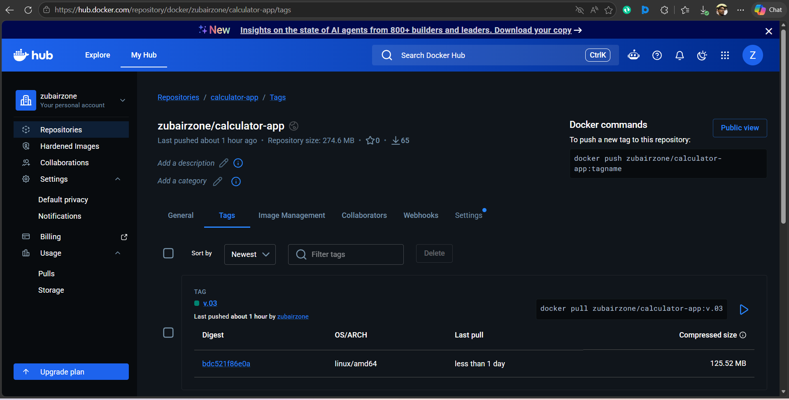

# Spring Boot Calculator CI/CD Pipeline on Amazon EKS

## 1. Project Overview

This project demonstrates a complete CI/CD pipeline for deploying a Spring Boot calculator application on Amazon EKS using Jenkins, Docker, Kubernetes, and Docker Hub.

The project includes:

1. Spring Boot calculator application
2. Docker containerization
3. Jenkins CI/CD pipeline
4. Docker Hub image push
5. Kubernetes deployment on EKS
6. AWS Load Balancer integration
7. Fargate-based deployment

---

## 2. Tech Stack

1. Java 17
2. Spring Boot
3. Maven
4. Thymeleaf
5. Docker
6. Jenkins
7. Docker Hub
8. Kubernetes
9. Amazon EKS
10. AWS CLI
11. kubectl
12. eksctl
13. Helm

---

## 3. CI/CD Architecture

```text
GitHub
   ↓
Jenkins Pipeline
   ↓
Maven Build & Test
   ↓
Docker Build
   ↓
Push Image to Docker Hub
   ↓
Deploy to Amazon EKS
```

---

## 4. Project Structure

```text
calculator-app/
├── src/
│   ├── main/
│   │   ├── java/com/zubair/calculator_app/
│   │   │   ├── CalculatorAppApplication.java
│   │   │   ├── controller/CalculatorController.java
│   │   │   └── service/CalculatorService.java
│   │   └── resources/
│   │       ├── static/style.css
│   │       ├── static/script.js
│   │       └── templates/index.html
├── k8s/
├── pom.xml
├── Dockerfile
├── .dockerignore
├── .gitignore
├── Jenkinsfile

```

---

## 5. Spring Boot Application Setup

### Create the Project

Generate the project using Spring Initializr with:

1. Maven
2. Java 17
3. Spring Boot
4. Spring Web
5. Thymeleaf
6. Lombok

### Run Locally

```bash
mvn clean install
mvn spring-boot:run
```

Application runs on:

```text
http://localhost:8081
```

---

## 6. Docker Setup

### Dockerfile

```dockerfile
FROM eclipse-temurin:17-jre

WORKDIR /app

COPY target/calculator-app-0.0.1-SNAPSHOT.jar app.jar

EXPOSE 8081

ENTRYPOINT ["java","-jar","app.jar"]
```

### Build Docker Image

```bash
docker build -t calculator-app .
```

### Run Container

```bash
docker run -p 8081:8081 calculator-app
```

---

## 7. Push Image to Docker Hub

### Login

```bash
docker login
```

### Tag Image

```bash
docker tag calculator-app zubairzone/calculator-app:v1
```

### Push Image

```bash
docker push zubairzone/calculator-app:v1
```

---

## 8. Amazon EKS Setup

### Tools Installed

1. AWS CLI
2. kubectl
3. eksctl
4. Helm

### Create EKS Cluster

```bash
eksctl create cluster \
--name calculator-cluster \
--region ap-south-1
```

### Create Fargate Profile

```bash
eksctl create fargateprofile \
--cluster calculator-cluster \
--region ap-south-1 \
--name cal-fargate \
--namespace calci
```

### Install AWS Load Balancer Controller

1. Associate IAM OIDC provider
2. Create IAM policy
3. Create IAM role and service account
4. Install controller using Helm

---

## 9. Kubernetes Deployment

### calculator.yaml

This file contains:

1. Deployment
2. Service
3. Ingress

### Deploy Application

```bash
kubectl apply -f k8s/calculator.yaml
```

### Verify Deployment

```bash
kubectl get pods -n calci
kubectl get svc -n calci
kubectl get ingress -n calci
```

---

## 10. Jenkins CI/CD Pipeline

### Jenkins Pipeline Flow

```text
Git Clone
→ Maven Build
→ Docker Build
→ Docker Push
→ Kubernetes Deploy
```

### Jenkinsfile

The Jenkins pipeline automates:

1. GitHub checkout
2. Maven build
3. Docker image creation
4. Docker Hub push
5. Kubernetes deployment

### Jenkins Server Setup

Installed on Jenkins server:

1. Java
2. Maven
3. Docker
4. AWS CLI
5. kubectl
6. eksctl

---

## 11. Issues Faced and Fixes

### Port Conflict

Issue:

1. Jenkins already used port 8080.

Fix:

1. Spring Boot application moved to port 8081.

---

### API Issue

Issue:

1. `+` symbol converted into space in URL.

Fix:

```javascript
encodeURIComponent(operation)
```

---

### Docker Build Issue

Issue:

1. Docker build failed because JAR was ignored in `.dockerignore`.

Fix:

1. Updated `.dockerignore` correctly.

---

### Jenkins Git Branch Issue

Issue:

1. Jenkins expected different branch than GitHub.

Fix:

1. Aligned branch names between GitHub and Jenkins.

---

### Jenkins EKS Access Issue

Issue 1:

```text
kubectl apply failed inside Jenkins pipeline
```

Cause:

1. Jenkins user had no kubeconfig.

Fix:

```bash
cp ~/.kube/config /var/lib/jenkins/.kube/config
chown -R jenkins:jenkins /var/lib/jenkins/.kube
```

Issue 2:

```text
Unable to locate AWS credentials
```

Cause:

1. Jenkins user had no AWS CLI credentials.

Fix:

```bash
sudo su - jenkins
aws configure
```

---

## 12. Cleanup Commands

### Delete Deployment

```bash
kubectl delete deployment calculator-deployment -n calci
```

### Delete Service

```bash
kubectl delete svc calculator-service -n calci
```

### Delete Ingress

```bash
kubectl delete ingress calculator-ingress -n calci
```

### Delete Fargate Profile

```bash
eksctl delete fargateprofile \
--cluster calculator-cluster \
--name cal-fargate \
--region ap-south-1
```

### Delete EKS Cluster

```bash
eksctl delete cluster \
--name calculator-cluster \
--region ap-south-1
```

---

## 13. Screenshots and Videos

Add:

1. Local application screenshots
2. Docker build screenshots
3. Jenkins pipeline screenshots
4. Kubernetes deployment screenshots
5. EKS console screenshots
6. CI/CD execution videos

---

## 14. Conclusion

This project demonstrates a complete end-to-end CI/CD workflow using Spring Boot, Docker, Jenkins, Kubernetes, and Amazon EKS with Fargate deployment support.

The pipeline automatically builds, tests, containerizes, pushes, and deploys the application to Kubernetes using Jenkins automation.
